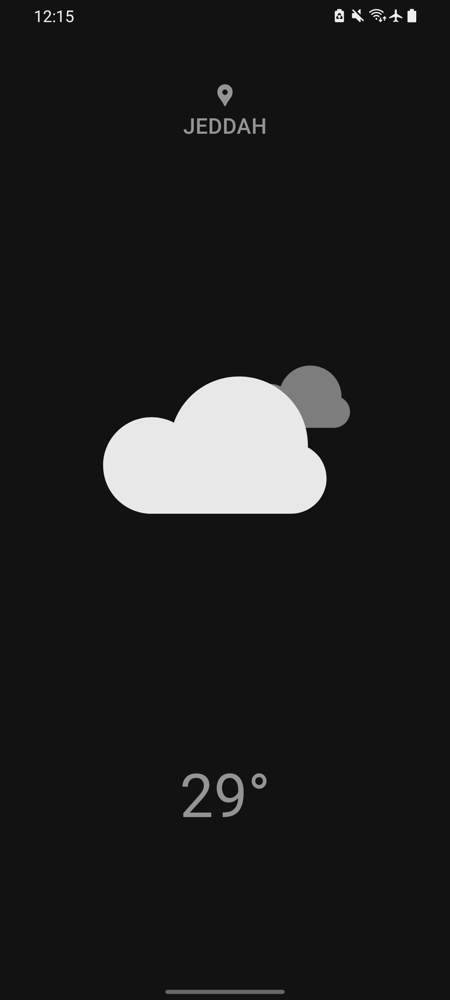

# Introduction

In this Project I followed [this tutorial](https://youtu.be/MMq4wkeHkPc?si=EXBqbFj0SvPwW07H) to create a Weather Application in flutter, in it I used the openweathermap api to get the weather information. and I changed the UI to make it more minimallistic.

## GUI Preview

 

## Getting Started

In oreder to use the application, you must use your own api key.
In the file my_data.dart:

```
├───lib
│   ├───bloc
│   ├───data
│   │     └──my_data.dart
│   └───screens
```

Use your own api key:

```
String API_KEY = '<Api Key>';
```
